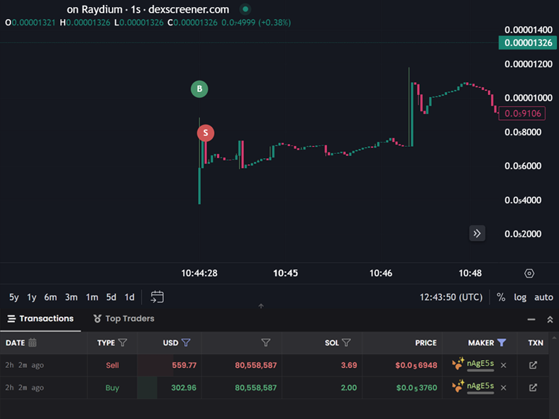
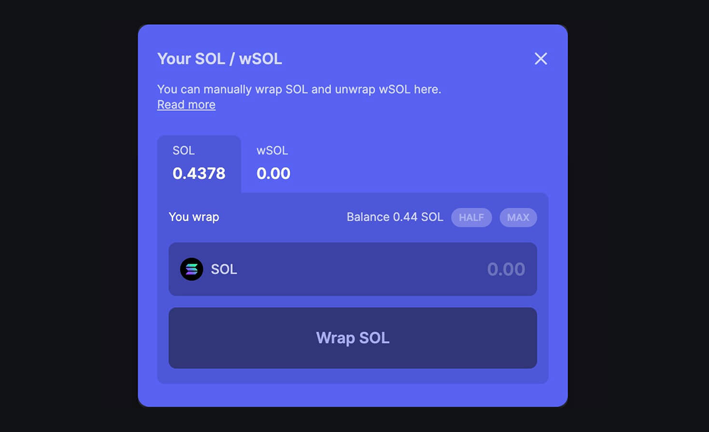
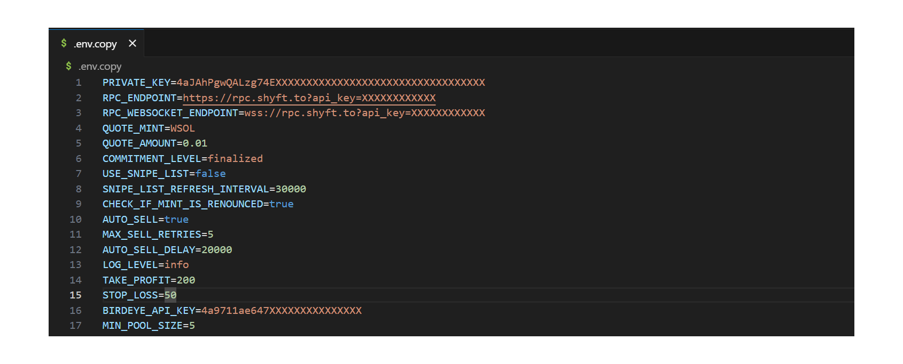

## **Smebra the ADVANCED Solana Raydium Token Sniper Bot (Updated December 2024)** 

SMEBRA The ADVANCED Solana Sniping Bot, made for ultra-fast token trading on Raydium liquidity pools (USDC/SOL). Features include automated buy/sell, take profit (TP), stop loss (SL), rug pull check, liquidity and renounce checks. Designed for fast trading on the Solana blockchain, ensuring precision, speed, and profitability for every transaction.

## **Why Smebra?** 
Smebra is the ONLY ORIGINAL, LASTEST, tool for highest-speed token trading on Solana. Unlike outdated or lower-quality imitators, this bot is added with the latest optimizations and features to ensure top-tier performance.

It listens to new Raydium USDC or SOL pools and buys tokens for a fixed amount in USDC/SOL.
Depending on the speed of the RPC node, the purchase usually happens before the token is available on Raydium UI for swapping.

## **All New Features**

- `WSOL Snipe`
- `Auto-Sell`
- `TP/SL`
- `Min Liq`
- `Burn/Lock Check`
- `Renounce Check`
- `Fast Buy`

> [!NOTE]
> This is provided as is, for learning purposes. Don't hesitate to contact me if you need any assistance.

## Pre-Setup
To run the script you need to:
1. Use your Solana Wallet that you use to trade tokens
2. Have enough SOL in it
3. Convert little SOL to USDC / WSOL (you need USDC or WSOL depending on the configuration you set, I personally use WSOL, as it is faster.)

`Jupiter Wrap` : https://jup.ag/ (To Convert SOL To WSOL)

4. The ratio I suggest is 1:10, that is, for every 1 WSOL / USDC you'll use per trade, have 10 SOL in the wallet (so if you're using 0.1 WSOL / USDC per trade, have 1 SOL in wallet. Just make sure you have more SOL than WSOL / USDC)
5. Although Smebra has a 95%+ Win Rate, only use the amount that you're okay losing.
6. Never put all your eggs in one basket, but also, make sure you don't miss out on a golden basket, which is Smebra ;)

## CONFIG
1. Configure the script by updating `.env.copy` file (**remove the .copy from the file name when done**).
2. `PRIVATE_KEY` (your wallet private key)
3. `RPC_ENDPOINT` (https RPC endpoint, use Helius / Quicknode Free Rpc Nodes for this)
4. `RPC_WEBSOCKET_ENDPOINT` (websocket RPC endpoint)
5. `QUOTE_MINT` (which pools to snipe, USDC or WSOL, I recommend WSOL)
6. `QUOTE_AMOUNT` (amount used to buy each new token)
7. `COMMITMENT_LEVEL`
8. `CHECK_IF_IS_BURNED` (liquidity burn check)
9. `CHECK_IF_IS_LOCKED` (liquidity lock check)
10. `USE_SNIPE_LIST` (buy only tokens listed in snipe-list.txt , used to snipe hype launches)
11. `SNIPE_LIST_REFRESH_INTERVAL` (how often snipe list should be refreshed in milliseconds)
12. `CHECK_IF_MINT_IS_RENOUNCED` (script will buy only if mint is renounced)
13. `MIN_POOL_SIZE` (script will buy only if pool size is greater than specified amount)
14. `TAKE_PROFIT=200` (in %)
15. `STOP_LOSS=50` (in %)
16. `BIRDEYE_API_KEY=` Generate here for free: https://docs.birdeye.so/docs/authentication-api-keys (Required Or Else TP/SL & Burn/Lock Won't Work)

  
## INSTALL
1. Download And Extract The Repository Files by:
   
   Using the command `git clone https://github.com/Smebra/ADVANCED-Solana-Raydium-Sniping-Bot`
   
   OR
   
   Click The Green "Code" Button Above and select "Download ZIP"

2. Install the Node.js environment on your computer (REQUIRED):
   
   https://nodejs.org/en

3. On Your Terminal / Command Prompt Navigate to Bot's File By Typing:
 
   `cd (our/bot/file/path/without/brackets)`

4. Install dependencies by typing:

    `npm install`

5. Remove The `.copy` from the `.env.copy` file and then open it & configure (Make Sure The Extension is .env & not .copy)

   
6. Run the script by typing:

    `npm run ssb`

7. PRINT PROFITS

   

## TAKE PROFIT

> [!NOTE]
> By default, 200 % 

## STOP LOSS

> [!NOTE]
> By default, 50 %

## AUTO SELL
By default, auto sell is enabled. If you want to disable it, you need to:
1. Change variable `AUTO_SELL` to `false`
2. Update `MAX_SELL_RETRIES` to set the maximum number of retries for selling token
3. Update `AUTO_SELL_DELAY` to the number of milliseconds you want to wait before selling the token (this will sell the token after the specified delay. (+- RPC node speed)).

If you set AUTO_SELL_DELAY to 0, token will be sold immediately after it is bought.
There is no guarantee that the token will be sold at a profit or even sold at all. The developer is not responsible for any losses incurred by using this feature.

## SNIPE LIST
By default, script buys each token which has a new liquidity pool created and open for trading.
There are scenarios when you want to buy one specific token as soon as possible during the launch event.
To achieve this, you'll have to use snipe list.
1. Change variable `USE_SNIPE_LIST` to `true` 
2. Add token mint addresses you wish to buy in `snipe-list.txt` file (add each address as a new line).

This will prevent script from buying everything, and instead it will buy just listed tokens.
You can update the list while script is running. Script will check for new values in specified interval (`SNIPE_LIST_REFRESH_INTERVAL`).

Pool must not exist before the script starts.
It will buy only when new pool is open for trading. If you want to buy token that will be launched in the future, make sure that script is running before the launch.

## COMMON ISSUES

> [!IMPORTANT]
> If you have an error which is not listed here, please create a new issue in this repository.
> To collect more information on an issue, please change `LOG_LEVEL` to `debug`.
> 
> ### EMPTY TRANSACTION
> If you see empty transactions on SolScan most likely fix is to change commitment level to `finalized`.
> 
> ### UNSOPPORTED RPC NODE
> If you see following error in your log file:  
> `Error: 410 Gone:  {"jsonrpc":"2.0","error":{"code": 410, "message":"The RPC call or parameters have been disabled."}, "id": "986f3599-b2b7-47c4-b951-074c19842bad"}`  
> It means your RPC node doesn't support methods needed to execute script.
> FIX: Change your RPC node. You can use Shyft, Helius or Quicknode. 
> 
> ### NO TOKEN ACCOUNT
> If you see following error in your log file:  
> `Error: No SOL token account found in wallet:`  
> it means that wallet you provided doesn't have USDC/WSOL token account.
> FIX: Go to [Jup.ag](https://jup.ag/) and swap some SOL to USDC/WSOL. When you swap sol to wsol you should see it in wallet.

## DISCLAIMER

> [!IMPORTANT]
> Use this script at your own risk.
